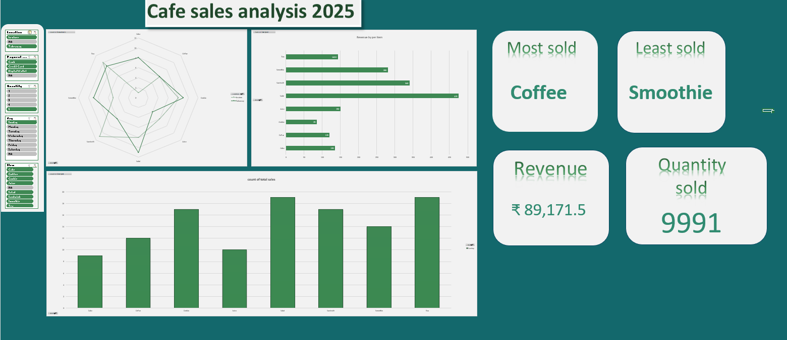

☕ Cafe Sales Performance Dashboard (2023)
End-to-End Data Cleaning, Analysis, and Visualization
📊 Executive Summary
This project transforms a raw dataset of 10,000+ transactions into a dynamic, interactive command center. The goal was to solve critical data integrity issues and provide a "single pane of glass" view for cafe management to identify revenue drivers, customer behavior patterns, and inventory efficiency.

🛠️ The Technical Challenge (ETL Process)
The raw data was provided in a highly "dirty" state, requiring a rigorous Extract, Transform, Load (ETL) process:

Data Integrity & Cleaning: Resolved missing item names and "NA" values in over 4,000 rows by implementing logic-based mapping.

Advanced Formula Logic: Developed a custom "Master Key" system using INDEX and MATCH to accurately link prices to items where data was missing.

Data Optimization: Converted raw ranges into Excel Tables to ensure the dashboard remains dynamic as new transaction data is added.

📈 Key Features & Insights
Interactive Slicers: Users can filter the entire dataset by Location (In-Store vs. Takeaway), Payment Method, and Quantity with a single click.

KPI Tracking: Real-time tracking of:

Total Revenue: ₹ 89,171.5

Total Volume: 9,991 Items Sold

Top Performer: Coffee

Low Performer: Smoothie

Multi-Dimensional Visualization:

Radar Charts: To analyze product distribution.

Clustered Bar Charts: For side-by-side revenue comparisons.

Trend Analysis: Tracking sales volume across categories.

🚀 Skills Demonstrated
Data Analysis: Pivot Tables, Pivot Charts, Data Grouping.

Excel Mastery: Power Query (Basic), Slicer Report Connections, Conditional Formatting.

Business Intelligence: Dashboard Design (UI/UX), KPI Development, Stakeholder-focused reporting.

📂 Repository Structure
📁 Data: Contains the raw (dirty) dataset and the final cleaned version.

📁 Dashboard: The final .xlsx file containing the interactive visual report.

📁 Documentation: Project overview and technical step-wise guide.

