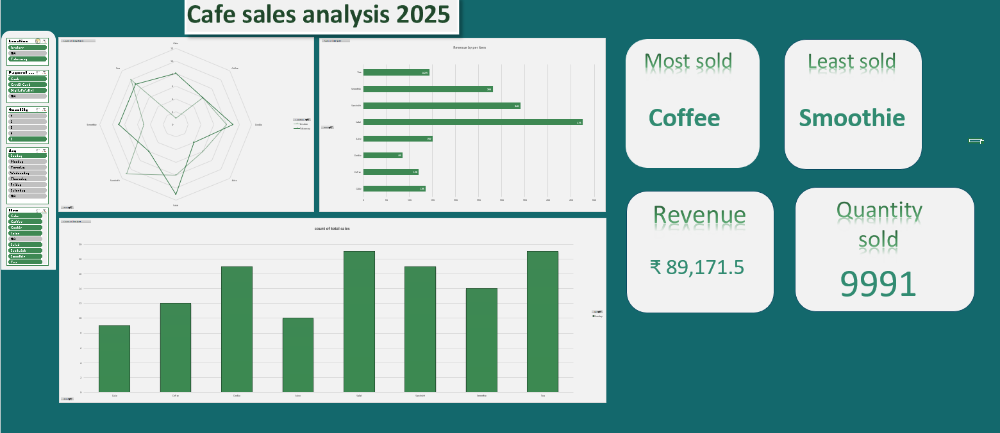

# ☕ Cafe Sales Performance Dashboard (2023)



<p align="center">
  
  
  
  
</p>

---

## 📌 Project Overview

This end-to-end project transforms a **raw, dirty dataset of 10,000+ cafe transactions** into a fully interactive business intelligence dashboard. It demonstrates a complete data analytics workflow — from messy raw data all the way to executive-ready visual insights.

> **Business Problem:** Cafe management had no clear visibility into which products drove revenue, how customer payment behavior varied, or which locations performed best. This dashboard solves all three.

---

## 📊 Key Results & KPIs

| Metric | Value |
|--------|-------|
| 💰 Total Revenue | ₹89,171.5 |
| 🧾 Total Transactions | 9,991 items sold |
| 🏆 Top Performing Product | Coffee |
| 📉 Low Performing Product | Smoothie |
| 🧹 Dirty Rows Cleaned | 4,000+ rows with missing/NA values |

---

## 🛠️ Technical Workflow (ETL Pipeline)

### 1. Extract — Raw Data Assessment
- Identified 4,000+ rows with missing item names and `NA` price values
- Flagged inconsistent data types, blank fields, and orphaned records

### 2. Transform — Data Cleaning & Engineering
- **Logic-based Mapping:** Built a custom "Master Key" system using `INDEX` + `MATCH` to accurately restore missing item-price relationships
- **Data Integrity Fixes:** Resolved all `NA` values using conditional formula logic instead of manual entry
- **Table Conversion:** Converted all raw ranges into structured Excel Tables for dynamic, auto-expanding dashboards

### 3. Load — Dashboard Construction
- Built Pivot Tables and Pivot Charts from the cleaned structured tables
- Connected all visuals to interactive Slicers for one-click filtering
- Designed a clean, professional UI layout focused on quick executive decision-making

---

## 📈 Dashboard Features

### Interactive Filters (Slicers)
- 📍 **Location** — In-Store vs. Takeaway
- 💳 **Payment Method** — Cash, Card, Digital Wallet
- 📦 **Quantity** — Filter by order size

### Visualizations
- **Radar Charts** — Product category distribution across all dimensions
- **Clustered Bar Charts** — Side-by-side revenue comparison by category
- **Trend Analysis** — Sales volume patterns across product lines
- **KPI Cards** — Live-updating revenue and volume metrics

---

## 🗂️ Repository Structure

```
📦 Cafe_Sales_analysis_Dashboard
├── 📁 data/
│   ├── raw_data.csv          # Original dirty dataset (10,000+ rows)
│   └── cleaned_data.csv      # Final processed & cleaned version
├── 📊 Dashboard.xlsx          # Interactive Excel dashboard (main file)
├── 🖼️ Dashboard_preview.png   # Visual preview screenshot
├── 📄 README.md               # Project documentation
└── 📜 LICENSE                 # MIT License
```

---

## ▶️ How to Use

1. **Download** `Dashboard.xlsx` from this repository
2. **Open** in Microsoft Excel 2016 or later (required for slicers & Power Query)
3. **Interact** using the slicers on the dashboard to filter by Location, Payment Method, or Quantity
4. All charts and KPI cards **update automatically** based on your selections

> ⚠️ Note: Enable macros/content if prompted by Excel for full interactivity.

---

## 💡 Skills Demonstrated

| Category | Skills |
|----------|--------|
| **Data Cleaning** | Missing value treatment, logic-based imputation, ETL design |
| **Excel Formulas** | `INDEX`, `MATCH`, `IF`, `IFERROR`, nested logic |
| **Data Modeling** | Structured Excel Tables, Pivot Tables, Data Grouping |
| **Visualization** | Pivot Charts, Radar Charts, Clustered Bar, Trend Lines |
| **BI & Reporting** | Slicer Report Connections, KPI Cards, Dashboard UI/UX |
| **Tools** | Microsoft Excel, Power Query (Basic), Conditional Formatting |

---

## 🔍 Key Business Insights

- **Coffee** is the undisputed revenue driver — ideal candidate for upselling and combo offers
- **Smoothies** underperform across all locations — worth reviewing pricing or promotion strategy
- **Takeaway orders** show distinct payment preferences compared to in-store — useful for payment infrastructure planning
- Peak sales patterns visible in the trend chart suggest time-based promotions could boost low-traffic periods

---

## 🚀 Future Improvements

- [ ] Migrate to Python (Pandas + Matplotlib/Seaborn) for automated cleaning pipeline
- [ ] Build an interactive web dashboard using Streamlit or Power BI
- [ ] Add month-over-month and year-over-year comparison metrics
- [ ] Incorporate customer segmentation analysis

---

## 👨‍💻 About the Author

**Varun Dadhwal** — Data Analyst | Python • SQL • Excel • Power BI

[](https://linkedin.com/in/varundadhwal)
[](https://kaggle.com/varundadwal)
[](https://github.com/VARUNDADHWAL)

---

## 📄 License

This project is licensed under the [MIT License](LICENSE) — feel free to use and build upon it with attribution.

---

<p align="center">⭐ If you found this project useful, please consider giving it a star!</p>
